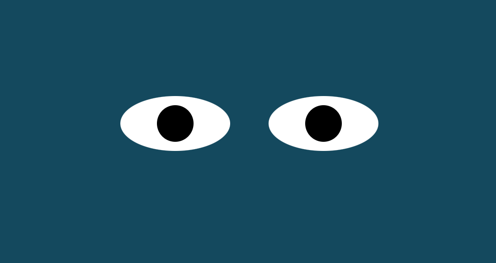

# eyes-project
this project is part of MIT Professional Certificate in Coding: Full Stack Development with MERN - week 8, it is a web page with two eyes that follow your mouse movement.
it builds using Javascript, HTML, and CSS.

## How to Run
Download the project and run the index.html using browser.

##Future Improvements
Add more face component that interact with the mouse movement.

## Support
github : thisisraghad

## License
MIT
